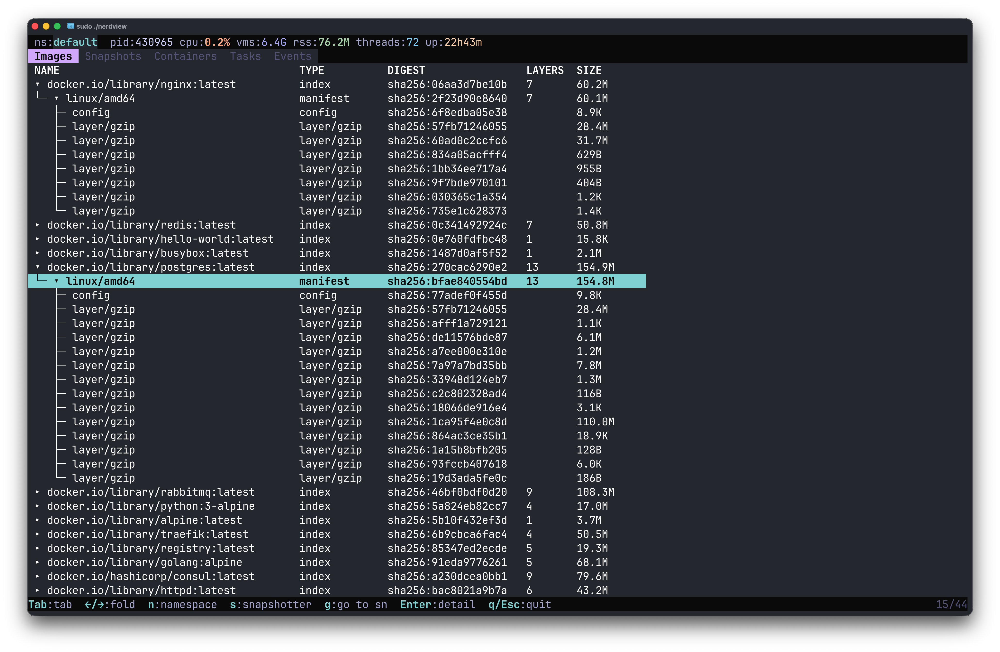

# nerdview

[](https://github.com/henry118/nerdview/actions/workflows/ci.yml)
[](LICENSE)

A read-only terminal UI for inspecting [containerd](https://containerd.io/) resources. Browse images, containers, tasks, snapshots, and events — without modifying anything.

> **Experimental** — under active development. Keybindings and features may change.



## Features

- **Images** — multi-platform index/manifest tree with layer counts and sizes
- **Snapshots** — parent-child chain with snapshotter selection
- **Containers** — sandbox/container grouping with runtime spec inspection
- **Tasks** — running processes including exec sessions, with PID, cmdline, cgroups, and namespaces
- **Events** — live stream of containerd lifecycle events
- **Live updates** — subscribes to containerd events and refreshes automatically
- **Cross-tab navigation** — jump between related resources (container → snapshot, task → container)

## Important notes

- **Read-only** — nerdview only reads from containerd. It will never create, delete, or modify any resources.
- **Linux only** — currently only implemented and tested on Linux.

## Install

```bash
git clone https://github.com/henry118/nerdview.git
cd nerdview
make build
```

Requires Go 1.26+ and containerd 2.0+.

## Usage

```bash
sudo ./nerdview                              # default namespace
sudo ./nerdview -n k8s.io                    # specify namespace
CONTAINERD_ADDRESS=/path/to/sock ./nerdview  # custom socket
```

Root (or equivalent) access is typically needed to reach the containerd socket.

## Key Bindings

| Key | Action |
|-----|--------|
| Tab / Shift+Tab | Next / previous tab |
| → / l | Unfold tree node |
| ← / h | Fold tree node |
| j / ↓ | Move down |
| k / ↑ | Move up |
| Enter | Detail popup |
| p | Runtime spec (containers) |
| g | Go to related resource |
| b | Go back |
| n | Switch namespace |
| s | Switch snapshotter |
| q / Esc | Quit |

## Status

This project is experimental. Contributions and bug reports are welcome.

## License

Apache 2.0 — see [LICENSE](LICENSE).
